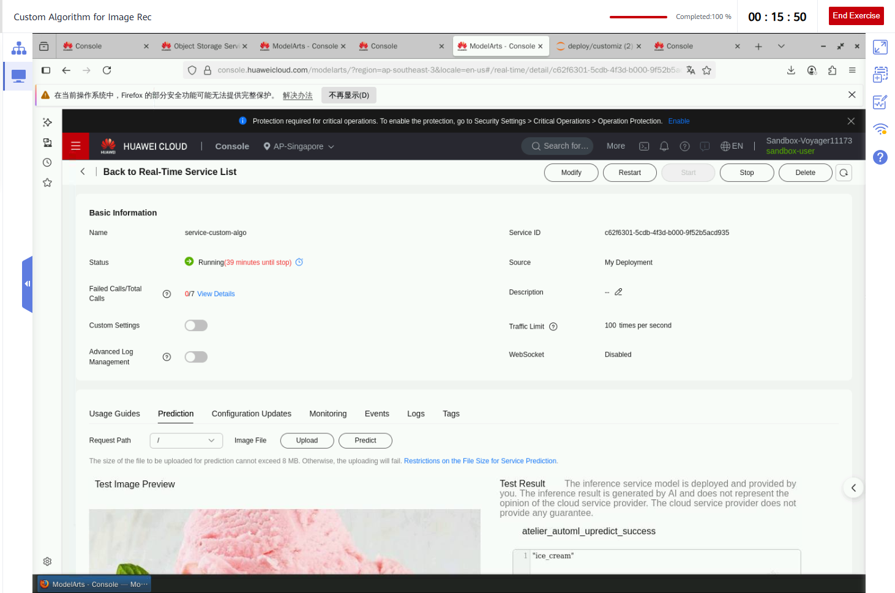

# Huawei Cloud AI Bootcamp – Custom Algorithm for Image Recognition

Bu repo, Huawei Cloud AI Bootcamp kapsamında gerçekleştirilen **Custom Algorithm for Image Recognition** lab çalışmasının özetini ve çıktılarımı içerir.  
Amaç, Huawei Cloud servislerini kullanarak özel bir görüntü tanıma algoritması geliştirmek, eğitmek ve gerçek zamanlı bir servis olarak dağıtmaktır.  

---

## Lab Özeti  

Bu laboratuvarda Huawei Cloud servisleri kullanılarak özel bir görüntü tanıma algoritması geliştirildi, eğitildi ve gerçek zamanlı servis olarak dağıtıldı.  

### Adımlar  
- **OBS (Object Storage Service):** Veri, kod ve çıktı için klasör yapısı (`data`, `code`, `output`) oluşturuldu.  
- **Dataset Yönetimi:** `foods_10c` veri seti indirildi, notebook ortamında açıldı ve OBS’ye yüklendi.  
- **Code Upload:** Eğitim kodları indirildi ve OBS’ye yüklendi.  
- **Custom Algorithm:** ModelArts üzerinde `algorithm-custom` adıyla PyTorch tabanlı özel algoritma tanımlandı (`run.py`).  
- **Training Job:** `job-custom-algo` eğitim işi oluşturuldu, GPU kaynakları kullanılarak 2 epoch boyunca model eğitildi.  
- **Service Deployment:** Model `model-custom-algo` adıyla AI Application olarak kaydedildi ve `service-custom-algo` adıyla gerçek zamanlı servis olarak dağıtıldı.  
- **Testing:** Servis çalışır duruma geldikten sonra test görselleri yüklenerek sınıflandırma başarıyla yapıldı.  

### Kazanımlar  
- Huawei Cloud OBS ile veri ve kod yönetimi  
- ModelArts üzerinde özel algoritma oluşturma  
- Training Job kurma ve GPU kaynaklarında çalıştırma  
- AI Application & Real-Time Service deployment  
- Gerçek zamanlı inference testi  

---

## Görsel

- Eğitim ve servis sürecinin son hali:  
    

- Lab rapor çıktısı:  
   

---

## 📌 Not  
Bu proje Huawei Cloud AI Bootcamp kapsamında gerçekleştirilmiştir.  
Amaç, bulut tabanlı yapay zeka uygulamalarını uçtan uca geliştirme, dağıtma ve yönetme süreçlerinde deneyim kazanmaktır.  
